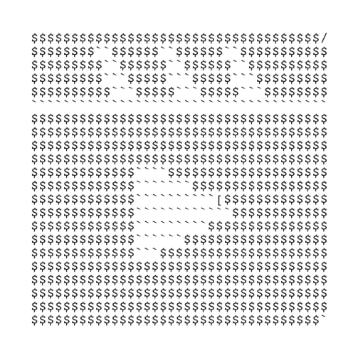

# video2asciiart



## 如何引用/安装

### 通过 npm 引入

```
npm install video2asciiart-vue --save
```

### CDN `<script>` 标签引入

在你的页面中插入`script`标签

```html
<script src="url">
```

查看[codepen]()live demo

## 如何使用

[实际效果演示]()

```js
// main.js
```

```vue
import Video2ASCIIArt from 'Video2ASCIIArt'
<template>
    <Video2ASCIIArt />
</template>
```

## 关于 demo 页面

```
yarn install
```

### Compiles and hot-reloads for development

```
yarn run serve
```

### Compiles and minifies for production

```
yarn run build
```

### Run your tests

```
yarn run test
```

### Lints and fixes files

```
yarn run lint
```

### Customize configuration

See [Configuration Reference](https://cli.vuejs.org/config/).
